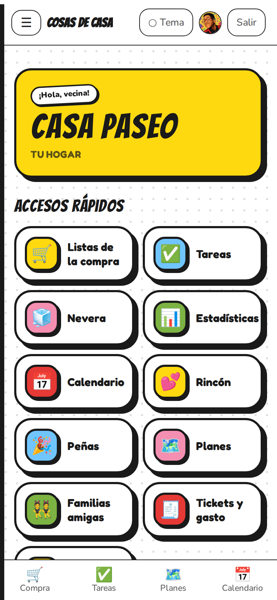
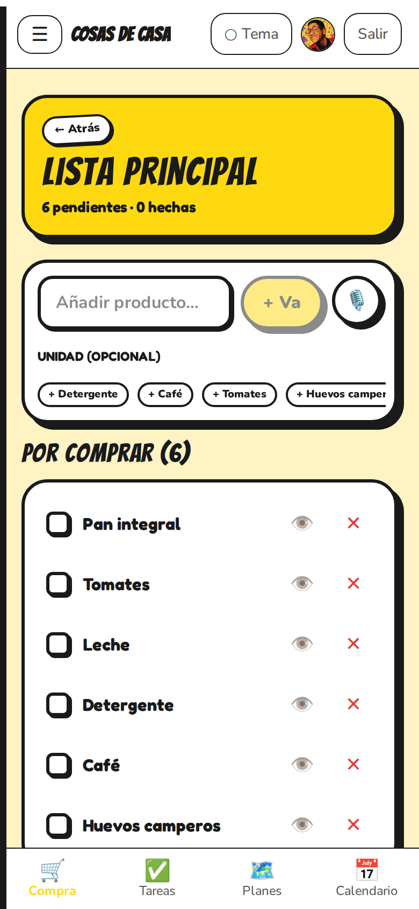
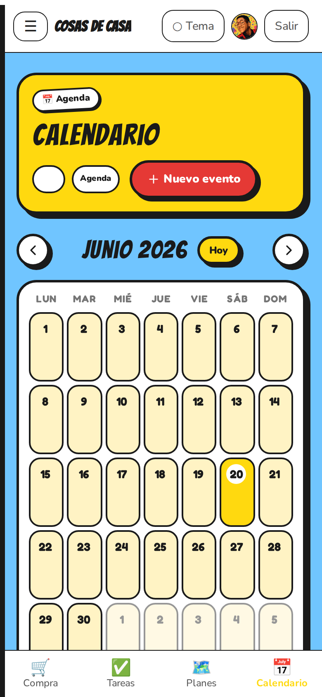

<div align="center">


# 🏠 Cosas de Casa

### La app para organizar tu hogar en familia — en tiempo real, sin conexión y con un toque de IA

**Lista de la compra por voz · Tareas · Nevera · Calendario · Planes · Presupuesto · y mucho más**

<br/>


</div>

> **TFM — Máster de Desarrollo con IA.** Una PWA real, offline-first y multi-familia para gestionar el día a día de una casa compartida (pareja, familia, pisos). Arquitectura hexagonal en el backend, *feature-sliced* y offline-first en el frontend, validación de extremo a extremo con Zod, y funciones de IA (voz, OCR de tickets, sugerencia de menús, deduplicación semántica).

---

## 📑 Índice

1. [Descripción general](#-descripción-general)
2. [Funcionalidades principales](#-funcionalidades-principales)
3. [Stack tecnológico](#-stack-tecnológico)
4. [Instalación y ejecución](#-instalación-y-ejecución)
5. [Estructura del proyecto](#️-estructura-del-proyecto)
6. [Arquitectura](#️-arquitectura)
7. [Usuario y contraseña de prueba](#-usuario-y-contraseña-de-prueba)
8. [Despliegue](#-despliegue)
9. [Entregables del TFM](#-entregables-del-tfm)

---

## 🎯 Descripción general

**Cosas de Casa** resuelve el caos de organizar una casa entre varias personas: cada uno apunta la compra donde puede, las tareas no están claras, nadie sabe qué hay en la nevera ni qué plan hay el finde. La app reúne **todo lo del hogar en un único sitio compartido y en tiempo real**, y funciona **aunque te quedes sin conexión** (es una PWA instalable).

Está pensada como un producto real: multi-familia, con invitaciones por PIN, roles, gestión de cuenta y **cuatro estéticas (*themes*) intercambiables** con modo claro y oscuro. El dominio se modela en español y la documentación del *porqué* vive en [`docs/`](docs/) (ADRs, patrones transversales y un módulo por contexto).

<div align="center">



</div>

---

## ✨ Funcionalidades principales

| | Funcionalidad | Detalle |
|---|---|---|
| 🛒 | **Lista de la compra por voz + IA** | Dicta la lista (Web Speech), la IA extrae los productos y **evita duplicados** con deduplicación semántica por *embeddings*. Comentarios por artículo. |
| ✅ | **Tareas del hogar** | Crea, asigna, cambia de estado y adjunta **fotos**; reparte quién hace qué en casa. |
| 🧊 | **Nevera, congelador y despensa** | Controla lo que tienes; marca como *comido / tirado / congelado*. |
| 📅 | **Calendario familiar** | Eventos de toda la familia con asistentes, en tiempo real. |
| 🗺️ | **Planes con mapa y chat** | Organiza planes, elige el sitio con **Google Maps (Places)**, chat por plan y RSVP. |
| 🧾 | **Tickets y presupuesto** | Escanea tickets con **OCR**, controla el gasto por categoría. |
| 🍳 | **Menú de la nevera (IA)** | Sugerencias de qué cocinar con lo que tienes, y pásalo a la lista de la compra. |
| 💕 | **Rincón de pareja** | Notas, retos y detalles privados para dos. |
| 🎉 | **Peñas y familias amigas** | Lo social: grupos y conexiones entre hogares. |
| 📊 | **Estadísticas** | Quién colabora más en casa (*leaderboard*). |
| 👤 | **Cuenta y familia** | Avatar, cambio de nombre/contraseña/email, recuperación de contraseña, gestión de miembros (roles, expulsar), salir y borrar cuenta. |
| 🎨 | **4 themes + claro/oscuro** | *Clásico* (shadcn), *Cuaderno*, *Sitcom 70s* y *Hommer* (cómic pop). La misma app, 4 personalidades. |
| 📲 | **PWA offline-first** | Instálala como app; funciona sin conexión (Dexie + *outbox* que se sincroniza al reconectar). Realtime con Supabase. |

---

## 🧰 Stack tecnológico

**Monorepo** gestionado con **pnpm + Turborepo** (3 paquetes):

| Capa | Tecnologías |
|---|---|
| **Backend** (`apps/api`) | **NestJS 11** · arquitectura **hexagonal por contexto** (15 *bounded contexts*) · **Drizzle ORM** · **PostgreSQL** · validación con **Zod** (nestjs-zod) · auth JWT verificada por **JWKS** (`jose`) |
| **Frontend** (`apps/web`) | **React 19** · **Vite 6** · **TanStack Router + Query** · **Zustand** · **Dexie** (IndexedDB, offline-first) · **PWA** (`vite-plugin-pwa`, service worker propio) · **Tailwind v4 + shadcn** · 4 themes |
| **Contratos** (`packages/contracts`) | **Zod** — única fuente de verdad de tipos y validación compartida entre API y web |
| **Plataforma** | **Supabase** (Postgres + Auth + **Storage** + **Realtime**) · **Google Maps** (Places) · IA: Web Speech (voz), OCR de tickets, menús y *embeddings* |
| **Calidad** | **Vitest** (unit + integración) · **Playwright** (E2E) · ESLint · Prettier · **GitHub Actions** (CI) |

---

## 🚀 Instalación y ejecución

### Requisitos
- **Node 20.10+** y **pnpm 11**
- **Docker** (para el Supabase local) y **Supabase CLI**

### Pasos

```bash
# 1) Clonar e instalar
git clone <URL-del-repo>
cd cosasdecasa
pnpm install

# 2) Configurar variables de entorno (ver tabla más abajo)
#    crea un .env en la raíz con los valores de Supabase, etc.

# 3) Levantar Supabase local (Postgres + Auth + Realtime + Storage)
pnpm db:start
pnpm --filter @cosasdecasa/api db:migrate   # aplica las migraciones de la BD

# 4) Arrancar API (NestJS) + web (Vite) a la vez
pnpm dev
```

- **Web:** http://localhost:5173 · **API:** http://localhost:3000/api/v1 · **Swagger:** http://localhost:3000/api/docs

### Variables de entorno (`.env` en la raíz)

| Variable | Para qué |
|---|---|
| `DATABASE_URL` | Conexión a Postgres (rol que respeta RLS, **no** service_role) |
| `SUPABASE_URL`, `SUPABASE_PUBLISHABLE_KEY` | Cliente Supabase del backend |
| `JWT_JWKS_URL`, `JWT_ISSUER`, `JWT_AUDIENCE` | Verificación del JWT de Supabase |
| `SUPABASE_SERVICE_ROLE_KEY` | *(opcional)* borrar el usuario de Supabase Auth al darse de baja |
| `MINIMAX_*`, `VAPID_*` | *(opcional)* IA y notificaciones push |
| `VITE_SUPABASE_URL`, `VITE_SUPABASE_ANON_KEY` | Cliente Supabase del frontend |
| `VITE_GOOGLE_MAPS_API_KEY` | Mapa de los planes (restringe la key por referente HTTP) |

### Comandos útiles

```bash
pnpm dev               # API + web en watch
pnpm build             # build de todo (Turbo)
pnpm lint              # eslint
pnpm type-check        # tsc --noEmit por paquete
pnpm test:unit         # vitest (unitarios) — lo que corre en CI
pnpm test:integration  # integración de la API (necesita Supabase + .env)
pnpm test:e2e          # Playwright
pnpm db:start / db:stop / db:reset
```

---

## 🗂️ Estructura del proyecto

```
cosasdecasa/
├── apps/
│   ├── api/                      # Backend NestJS — hexagonal por contexto
│   │   └── src/contexts/<ctx>/   # 15 bounded contexts, cada uno con 4 capas:
│   │       ├── domain/           #   agregados, puertos (interfaces), errores
│   │       ├── application/      #   casos de uso (*.use-case.ts), read models
│   │       ├── infrastructure/   #   repos Drizzle, mappers, adaptadores
│   │       └── interface/        #   controllers, DTOs, guards de scope
│   └── web/                      # Frontend React — feature-sliced + offline-first
│       └── src/
│           ├── features/<f>/     #   {components,pages,views,hooks,store,offline}
│           │   └── views/{base,cozy,cozysitcom,springfield}/   # 1 celda por theme
│           ├── core/             #   router, providers
│           └── shared/           #   lib (api, supabase), theme, ui, components
├── packages/contracts/           # Schemas Zod compartidos (fuente de verdad)
├── docs/                         # ADRs, didáctica, módulos por contexto, TFM
├── supabase/                     # config + migraciones de Storage/Realtime
└── .github/workflows/            # CI
```

---

## 🏛️ Arquitectura

- **Backend hexagonal por contexto:** cada *bounded context* tiene `domain / application / infrastructure / interface` con dependencia hacia dentro. Los puertos se inyectan por **token** (DI), nunca por clase concreta. El dominio no conoce NestJS ni Drizzle.
- **Contracts como fuente de verdad:** todo schema/validación nace en `packages/contracts` (Zod) y lo consumen API y web → cero duplicación de tipos.
- **Offline-first (ADR 0006):** la UI lee **siempre** de Dexie (IndexedDB); las escrituras van a un *outbox* que se reproduce contra la API al reconectar. La caché de queries se persiste para sobrevivir a un *refresh* sin conexión.
- **Seguridad:** JWT de Supabase verificado por JWKS, aprovisionamiento *just-in-time* del usuario, y **guards de scope por recurso** (familia/lista/…) además de RLS en Postgres.
- **Themes:** sistema de 4 estéticas con tokens CSS semánticos por theme + modo claro/oscuro; cada pantalla tiene una celda presentacional por theme, *code-split* por `React.lazy`.

> El *porqué* de cada decisión está documentado en [`docs/adr/`](docs/adr/), [`docs/didactica/`](docs/didactica/) y [`docs/modules/`](docs/modules/).

---

## 🔑 Usuario y contraseña de prueba

> La app tiene login. Para revisar el TFM sin registrarte, usa esta cuenta de demo (ya tiene una familia **"Casa Paseo"** con datos: lista de la compra, tareas y nevera):

```
📧  Email:       paseo1781858100612@test.local
🔑  Contraseña:  qwertyui
```

*(En el despliegue público se proporcionará una cuenta equivalente; ver el formulario de entrega.)*

---

## 🌐 Despliegue

> URL del proyecto en funcionamiento: **_(añadir aquí la URL de despliegue)_**

La app está preparada para desplegarse como:
- **Frontend (PWA):** build estático de `apps/web` (`pnpm --filter @cosasdecasa/web build`) servible en Vercel/Netlify/Cloudflare Pages.
- **Backend:** `apps/api` (NestJS) en cualquier runtime Node (Railway/Render/Fly).
- **Datos:** proyecto Supabase (Postgres + Auth + Storage + Realtime).

Las variables de entorno necesarias están en la sección [Instalación](#-instalación-y-ejecución).

---

## 🎬 Entregables del TFM

| Entregable | Ubicación |
|---|---|
| **Documentación** (este README) | `README.md` |
| **Landing** del proyecto | ruta `/landing` (estética Hommer) + [`apps/web/src/features/landing`](apps/web/src/features/landing) |
| **Vídeo demo** del producto | [`apps/web/public/landing/demo.mp4`](apps/web/public/landing/demo.mp4) |
| **Guion del vídeo** de explicación | [`docs/tfm/guion-video.md`](docs/tfm/guion-video.md) |
| **Slides** de la presentación | [`docs/tfm/slides.md`](docs/tfm/slides.md) |
| **Vídeo de explicación** (captura + voz) | **_(añadir aquí la URL pública del vídeo)_** |
| **Presentación** (Slides/Canva) | **_(añadir aquí la URL pública de las slides)_** |

---

<div align="center">

**Cosas de Casa** · TFM Máster de Desarrollo con IA · Pablo Ruiz

</div>
