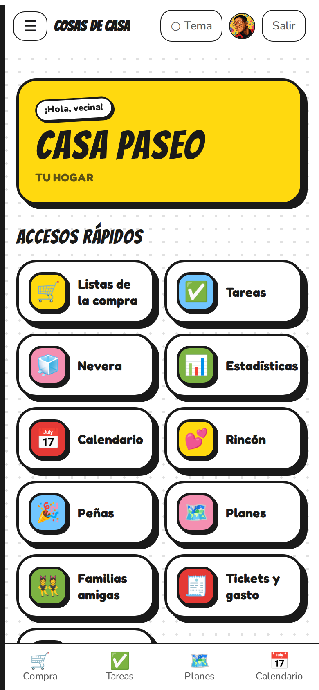
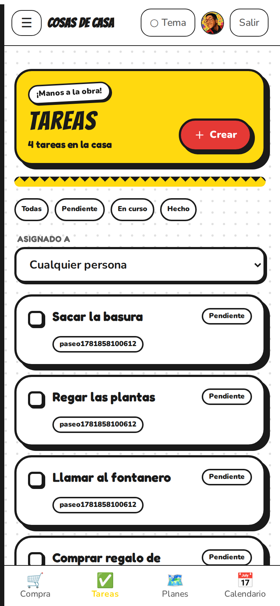
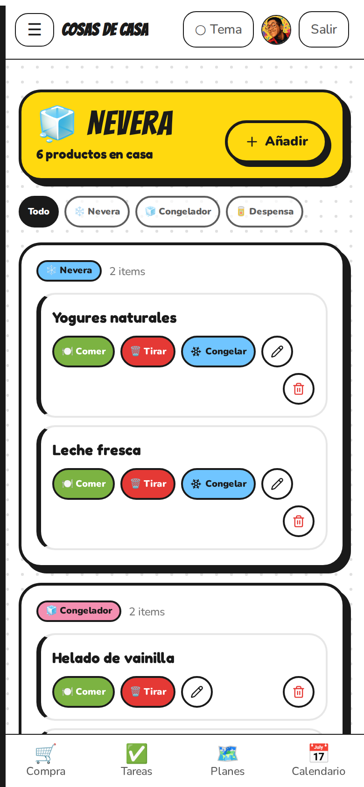
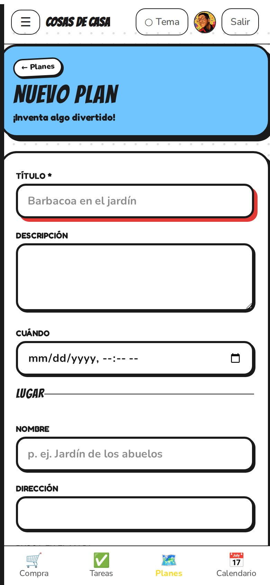
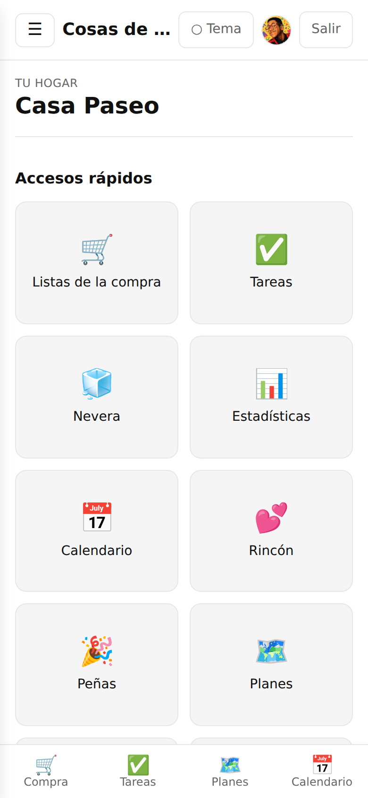
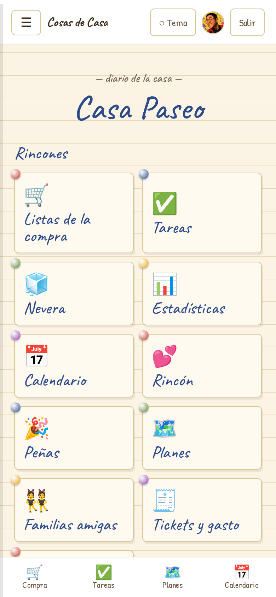
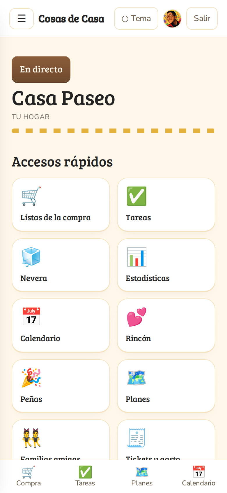

<!-- _class: lead -->
<!-- _paginate: false -->

# 🏠 Cosas de Casa

## La app para organizar tu hogar en familia

En tiempo real · sin conexión · con un toque de IA

<br/>

**TFM — Máster de Desarrollo con IA**
Pablo Ruiz

---

# El problema

Organizar una casa entre varias personas es un **caos**:

- 🛒 Cada uno **apunta la compra** donde puede: notas del móvil, papelitos, mensajes sueltos.
- ✅ Las **tareas** no están claras y siempre las hace el mismo.
- 🧊 Nadie sabe **qué hay en la nevera** → compras dos veces lo mismo.
- 📅 ¿Y el **plan del finde**? En cinco chats distintos.

> Falta **un único sitio compartido** que funcione **aunque te quedes sin cobertura**.

---

# La solución

**Cosas de Casa** reúne todo el hogar en una sola app:

- 🌍 **Multi-familia**: invitaciones por PIN, roles y gestión de miembros.
- ⚡ **Tiempo real**: lo que apunta uno lo ve el resto al instante.
- 📲 **PWA offline-first**: instalable y funcional **sin conexión**.
- 🤖 **IA aplicada** donde aporta: voz, OCR, menús y deduplicación.
- 🎨 **Cuatro estéticas** intercambiables con modo claro y oscuro.

> Pensada como un **producto real**, no como una demo de juguete.

---

# Funcionalidades (1/2)

| | Función | Qué hace |
|---|---|---|
| 🛒 | **Compra por voz + IA** | Dictas, la IA extrae productos y **evita duplicados** por *embeddings*. |
| ✅ | **Tareas** | Crea, asigna, cambia de estado y adjunta **fotos**. |
| 🧊 | **Nevera / congelador / despensa** | Marca *comido · tirado · congelado*. |
| 📅 | **Calendario** | Eventos con asistentes, **en tiempo real**. |
| 🗺️ | **Planes** | Elige sitio con **Google Maps**, chat y RSVP por plan. |
| 🧾 | **Tickets + presupuesto** | **OCR** de tickets y gasto por categoría. |

---

# Funcionalidades (2/2)

| | Función | Qué hace |
|---|---|---|
| 🍳 | **Menú de la nevera** | La IA sugiere **qué cocinar** con lo que tienes. |
| 💕 | **Rincón de pareja** | Notas, retos y detalles privados para dos. |
| 🎉 | **Peñas y familias amigas** | Conecta hogares entre sí. |
| 📊 | **Estadísticas** | *Leaderboard*: quién colabora más en casa. |
| 👤 | **Cuenta y familia** | Avatar, nombre, contraseña, email, roles, baja. |
| 🎨 | **4 themes + claro/oscuro** | La misma app, cuatro personalidades. |

---

# La app en vivo

 

**Home** y **lista de la compra por voz** — el corazón de la app.

> Dictas la compra y la IA la entiende, separa los productos y **no duplica** lo que ya tenías.

---

# Más pantallas

  

Tareas con fotos · Nevera · Planes con mapa y chat

> Todo compartido por la familia y actualizado **en tiempo real**.

---

# Los 4 themes

   

**Clásico** · **Cuaderno** · **Sitcom 70s** · **Hommer** (cómic pop)

> Cada uno con **modo claro y oscuro**. Una sola base de código, cuatro estéticas: cada pantalla tiene una celda presentacional por theme.

---

# Arquitectura — backend

**NestJS 11 · hexagonal por contexto** (15 *bounded contexts*)

Cada contexto, 4 capas con la dependencia **hacia dentro**:

- **`domain/`** — agregados, **puertos** (interfaces), errores. Sin NestJS ni SQL.
- **`application/`** — un caso de uso por archivo, read models (CQRS).
- **`infrastructure/`** — repos Drizzle, mappers, adaptadores.
- **`interface/`** — controllers, DTOs, guards de scope.

> Los puertos se inyectan **por token**, nunca por clase concreta. El dominio no conoce el framework.

---

# Arquitectura — contracts y frontend

**Contracts Zod** = única fuente de verdad

- El **mismo schema** lo usan API y web → **cero tipos duplicados**.
- Lo que valida el backend es exactamente lo que espera el frontend.

**Frontend offline-first (React 19 + Vite)**

- La UI **siempre lee** de Dexie (IndexedDB local) → instantánea.
- Las escrituras van a un **outbox** que se reproduce al reconectar.
- **Realtime** con Supabase para actualizar en vivo.

`UI → Dexie → outbox → API` (al volver la conexión)

---

# Stack tecnológico

| Capa | Tecnologías |
|---|---|
| **Backend** | NestJS 11 · Drizzle ORM · PostgreSQL · Zod · JWT (JWKS) |
| **Frontend** | React 19 · Vite 6 · TanStack Router/Query · Zustand · Dexie · PWA |
| **Contratos** | Zod compartido (API + web) |
| **Plataforma** | Supabase (Postgres · Auth · Storage · Realtime) · Google Maps |
| **IA** | Voz (Web Speech) · OCR de tickets · menús · *embeddings* |
| **Calidad** | Vitest · Playwright · ESLint · Prettier · GitHub Actions |

> **Monorepo** pnpm + Turborepo, 3 paquetes.

---

# IA en el proyecto

IA **aplicada con cabeza**, no por moda:

- 🎙️ **Voz → productos**: dictas la lista y la IA la estructura.
- 🧠 **Deduplicación semántica**: *embeddings* entienden que "leche" y "dos litros de leche" son lo mismo.
- 🧾 **OCR de tickets**: lee el gasto de una foto del recibo.
- 🍳 **Sugerencia de menús** con lo que hay en la nevera.

> **IA *gated***: si un servicio de IA no responde, la app **degrada con elegancia** (HTTP 503) en vez de romperse. La experiencia nunca depende de que la IA esté disponible.

---

# Calidad y proceso

- ✅ **Vitest** — tests unitarios y de integración del backend.
- 🎭 **Playwright** — tests end-to-end.
- 🤖 **GitHub Actions (CI)** — build · lint · type-check · unit en cada cambio.
- 🧱 **Validación de extremo a extremo** con Zod.
- 🔐 **Seguridad**: JWT por JWKS, *guards* de scope por recurso + RLS en Postgres.
- 📚 **Documentación del *porqué***: ADRs, patrones y un módulo por contexto en `docs/`.

---

# Conclusiones y aprendizajes

- 🏛️ Una **arquitectura limpia** (hexagonal + contratos compartidos) escala y se entiende.
- 📴 El **offline-first** de verdad cambia la experiencia: rápida y resistente a la red.
- 🤖 La **IA aporta cuando resuelve un problema real**, no por estar de moda.
- 🧩 Un **monorepo bien organizado** mantiene API, web y tipos en sintonía.
- 🎨 Separar **lógica de presentación** permite 4 themes sin duplicar lógica.

> El reto no fue una sola tecnología, sino **integrarlas con criterio** en un producto coherente.

---

<!-- _class: lead -->
<!-- _paginate: false -->

# ¡Gracias! 🏠

**Cosas de Casa** · TFM Máster de Desarrollo con IA · Pablo Ruiz

<br/>

🔗 **Repositorio:** (URL)
🌐 **Demo en vivo:** (URL)
🎬 **Vídeo de explicación:** (URL)

<br/>

*Cuenta de demo:* `paseo1781858100612@test.local`

---

<!-- _paginate: false -->

## 📦 Cómo exportar estas slides

Desde la raíz del repo:

```bash
# PDF
npx @marp-team/marp-cli docs/tfm/slides.md --pdf

# HTML
npx @marp-team/marp-cli docs/tfm/slides.md --html

# PowerPoint (PPTX)
npx @marp-team/marp-cli docs/tfm/slides.md --pptx

# Previsualizar mientras editas
npx @marp-team/marp-cli docs/tfm/slides.md --preview --watch
```

> Las imágenes se referencian con rutas **relativas** a este archivo (`../../apps/web/public/landing/shots/`). Exporta **desde la raíz del repo** para que se resuelvan bien. En VS Code también puedes usar la extensión *Marp for VS Code*.
